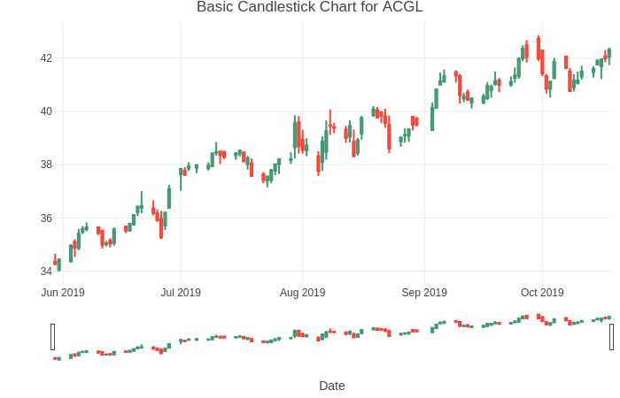

Created by [Paul Adams](https://github.com/PaulAdams4361) and [Jeff Nguyen](https://github.com/7446Nguyen).
# Time-Series Analysis 
## Market Trading Investments Forecasting Strategy with ARIMA, Neural Networks using Multi-Layered Perceptrons, Signal-Plus-Noise, Vector Autoregressive (VAR) and composite ensemble models.
Here's a refined version of your **README.md** for the [Time-Series-Analysis-ARIMA-and-Neural-Nets](https://github.com/7446Nguyen/Time-Series-Analysis-ARIMA-and-Neural-Nets) repository:

---

## Overview

This project presents a comprehensive analysis of time-series forecasting methodologies applied to stock market data. Leveraging data from 3,202 NASDAQ-listed companies between May 30th and October 30th, 2019, the study explores various models to predict stock prices and trading volumes. The primary techniques include:

- **ARIMA (AutoRegressive Integrated Moving Average)**
- **Neural Networks with Multi-Layered Perceptrons (MLP)**
- **Signal-Plus-Noise Models**
- **Vector Autoregressive (VAR) Models**
- **Composite Ensemble Models**

## Repository Structure

- **Data/**: Contains the dataset `NASDAQ_Daily_ACGL.csv` used for analysis.
- **Notebooks/**:
  - `Time-Series-Project.Rmd`: R Markdown file detailing the time-series analysis and modeling process.
  - `Stock-Selection-Model-Final.Rmd`: R Markdown file focusing on the stock selection model development.
- **Outputs/**:
  - `Time-Series-Project.html`: HTML output of the time-series analysis notebook.
  - `Stock-Selection-Model-Final.html`: HTML output of the stock selection model notebook.
  - `FinalPresentation.pptx`: PowerPoint presentation summarizing the project's objectives, methodologies, results, and conclusions.
  - `Candlestick_Plot.png`: Visualization of stock price movements using a candlestick chart.

## Key Features

- **Data Preprocessing**: Handling missing values, normalization, and transformation of stock price and volume data.
- **Model Implementation**:
  - **ARIMA**: Capturing temporal dependencies in stock prices.
  - **Neural Networks (MLP)**: Modeling complex, non-linear relationships in time-series data.
  - **Signal-Plus-Noise Models**: Decomposing time-series into signal and noise components for improved forecasting.
  - **VAR Models**: Analyzing multivariate time-series data to capture interdependencies among multiple stocks.
  - **Ensemble Models**: Combining forecasts from multiple models to enhance prediction accuracy.
- **Visualization**: Utilizing candlestick plots and other graphical representations to illustrate stock trends and model predictions.

## Getting Started

1. **Clone the Repository**:
   ```bash
   git clone https://github.com/7446Nguyen/Time-Series-Analysis-ARIMA-and-Neural-Nets.git
   cd Time-Series-Analysis-ARIMA-and-Neural-Nets
   ```
2. **Set Up Environment**:
   - Ensure R and RStudio are installed.
   - Install necessary R packages as specified in the `.Rmd` files.
3. **Run Notebooks**:
   - Open the `.Rmd` files in RStudio to reproduce the analysis and visualizations.

## Data Source

The dataset `NASDAQ_Daily_ACGL.csv` comprises daily stock prices and volumes for NASDAQ-listed companies within the specified date range. This data serves as the foundation for modeling and forecasting exercises conducted in the project.

## Authors

- **Paul Adams**
- **Jeff Nguyen**

## Acknowledgments

We extend our gratitude to the open-source community for providing the tools and datasets that facilitated this analysis.


<p align="center"> 

</p>
